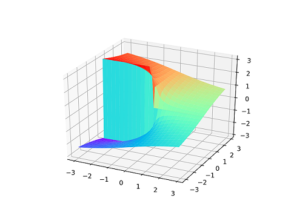
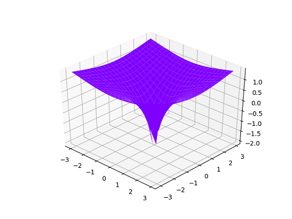

# 3D Representations of Complex Logarithms

This project generates 3D graphs, based on the logarithms of complex numbers. By writing a complex number in the form re<sup>ia</sup> where r is the modulus of the complex number and a is the angle from the real plane, it is easy to take the logarithm of that complex number.

Log(z) = log(re<sup>ia</sup>) = log(r) + log(e<sup>ia</sup>) = log(r) + re<sup>ia</sup>

The domain must be restricted because the function is periodic, since adding multiples of 2Pi gives the same
result. Therefore the graphs generated show a single branch, and do not represent the entire function.

## Getting Started

These instructions will help you to get you a copy of the project running on your local machine.

### Prerequisites

You will need these python modules to be able to run the project.

```
matplotlib - pip install matplotlib
numpy - pip install numpy
```

### Installing

Clone this repository using terminal:

```
git clone https://github.com/LucasBN/Complex-Logarithms.git
```

To run the program open the cloned repository in terminal and type:

```
python main.py
```

### Examples

The imaginary part over the complex plane:



The real part over the complex plane:



### Creating your own plots

To plot your own function over the complex plane, create a function that returns a value for z given a complex number. (See example functions.)

Once you have created your function, make sure to assign the zs variable to its return value, by changing:

```
zs[xi,yi] = complex_log_real(z)
```

To:

```
zs[xi,yi] = new_zs_function(z)
```

## Authors

* **Lucas BN** - *Initial work*

## Acknowledgments

* [3blue1brown](https://www.youtube.com/channel/UCYO_jab_esuFRV4b17AJtAw)
* [Xander Gouws](https://www.youtube.com/watch?v=SYxyemNSSm8)
